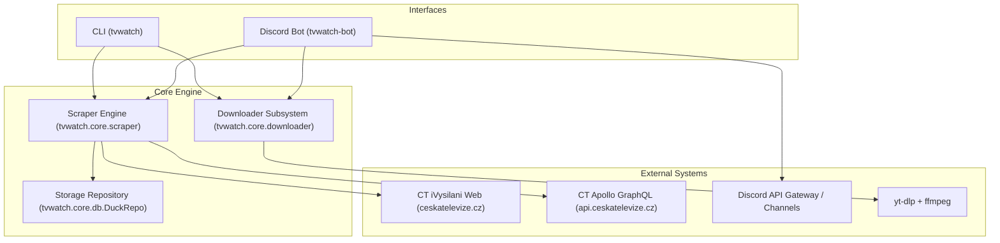

# System Architecture

This document describes the technical architecture, data pipelines, storage model, and external integration points of tvwatch.

---

## 1. Overview and Component Architecture

tvwatch monitors Ceska televize (iVysilani) broadcast catalogs, stores show watchlists and episode discovery state in DuckDB, dispatches notifications, and triggers downloads using yt-dlp.



---

## 2. Show and Episode Resolution Pipeline

Ceska televize uses a Next.js front-end powered by an Apollo GraphQL backend with persisted queries. Understanding the difference between catalog identifiers is critical to reliably resolving shows and episodes.

### Show Identifiers: SIDP versus IDEC

- **SIDP (Catalog Series ID)**:
  - Appears in the public URL slug (e.g., `16560311257-tobias-lolness` -> `16560311257`).
  - Represents the show catalog entry across all seasons and releases.
- **IDEC (Internal Production ID)**:
  - A 15-digit internal identifier assigned to the show production (e.g., `225384613200026`).
  - The GraphQL endpoint `episodesPreviewFind` strictly requires this 15-digit `idec` parameter. Passing the `sidp` yields zero results.

### Ingestion Workflow

1. **URL Normalization**:
   Incoming URLs are converted to the canonical pattern `https://www.ceskatelevize.cz/porady/<slug>/`, stripping query parameters, anchor hashes, and sub-paths (such as `/dily/` or `/bonus/`).
2. **Next.js Metadata Extraction**:
   The show page HTML is fetched. The JSON embedded in `<script id="__NEXT_DATA__">` is parsed to extract:
   - Internal show IDEC (`props.pageProps.data.show.idec`).
   - Title, description, and season information.
   - Initial server-rendered episode previews.
3. **Apollo Persisted Query Hash Resolution**:
   - Apollo Client on iVysilani enforces persisted queries via SHA-256 operation hashes.
   - `fetch_dynamic_graphql_hash` inspects script chunks loaded on the page.
   - If dynamic extraction fails or is unavailable, the verified fallback hash defined in `CONFIG.GRAPHQL_PERSISTED_HASH` is utilized.
4. **GraphQL Pagination**:
   - Requests are dispatched to `https://api.ceskatelevize.cz/graphql/` with `operationName: GetEpisodes`, `idec: <show_idec>`, and `onlyPlayable: True`.
   - The query automatically filters out expired licenses and unplayable episodes on the server side.
   - Pagination advances using `offset += len(items)` with a chunk size of 50 until `offset >= totalCount`.
5. **Fallback Strategy**:
   If the GraphQL service is unreachable or rejects the query, the scraper falls back to extracting all episode objects available in the Next.js `apolloState` cache and the JSON-LD `ItemList` embedded in the initial page response.

---

## 3. Storage and Deduplication Model

DuckDB is used as an embedded analytical datastore. Each Discord guild maintains its own database file (`data/guild_<guild_id>.duckdb`), while CLI operations use `episodes.duckdb`.

### Database Schema

#### tv_shows Table
Tracks watched programs and activation status:
```sql
CREATE TABLE IF NOT EXISTS tv_shows (
    url VARCHAR PRIMARY KEY,
    is_active BOOLEAN DEFAULT true,
    metadata JSON,
    added_at TIMESTAMPTZ,
    last_seen_at TIMESTAMPTZ
);
```

#### episodes Table
Tracks discovered episodes, playability, and notification history:
```sql
CREATE TABLE IF NOT EXISTS episodes (
    url VARCHAR PRIMARY KEY,
    show_url VARCHAR,
    idec VARCHAR,
    name VARCHAR,
    metadata JSON,
    first_discovered_at TIMESTAMPTZ,
    last_notified_at TIMESTAMPTZ,
    broadcast_at TIMESTAMPTZ
);
```

#### guild_config Table
Key-value configuration store per guild:
```sql
CREATE TABLE IF NOT EXISTS guild_config (
    key VARCHAR PRIMARY KEY,
    value VARCHAR
);
```

### Notification Deduplication and Cooldown

To prevent duplicate alerts, the repository provides `record_episode()`:

1. **Canonical Primary Key**:
   Episode URLs are normalized to `https://www.ceskatelevize.cz/porady/<slug>/<episode_id>/`. The 15-digit episode IDEC is tracked explicitly.
2. **Initial Addition Backfill**:
   When a show is added (`NOTIFY_ON_INITIAL_ADD = false`), all historical episodes present in the archive are indexed with `last_notified_at = now`. This prevents alerting the user about existing seasons when a show is first added.
3. **Notification Cooldown (`NOTIFICATION_COOLDOWN_DAYS`)**:
   - Brand new episodes have `last_notified_at = NULL` and trigger an alert.
   - Subsequent checks within the cooldown window (default: 30 days) are suppressed.
   - Re-aired episodes (reruns) that appear after the cooldown window expires become eligible for re-notification.
4. **State Transition**:
   When notifications are dispatched successfully to Discord or output via CLI, `mark_episodes_notified()` updates `last_notified_at` to the current timestamp.

---

## 4. Downloader Subsystem

The downloader module (`tvwatch.core.downloader`) handles downloading video streams using `yt-dlp`.

### Patched Extractor

Ceska televize migrated its media delivery to a new video-on-demand platform, deprecating the legacy `iframe-hash` endpoint used by older yt-dlp versions. 

To support reliable downloads:
- A custom patched extractor is maintained in `yt-dlp-patch/ceskatelevize.py`.
- It queries the new stream API at `https://api.ceskatelevize.cz/video/v1/playlist-vod/v1/stream-data/media/external/<idec>?canPlayDrm=true`.
- The extractor acquires DASH streams, multi-stream audio, and WebVTT subtitles.
- Downloads are executed sequentially by default to ensure predictable resource utilization and prevent server rate-limiting.

---

## 5. Discord Bot Architecture

The Discord bot interface (`tvwatch.interfaces.discord_bot`) operates as an interactive daemon using `discord.py` slash commands and background loops:

### Available Slash Commands
- `/add <url>`: Register a show for automated tracking with automatic background backfill.
- `/disable <url>`: Pause sync checks for a show.
- `/remove <url>`: Permanently remove a show and all associated episode history from the database.
- `/list`: Display all registered shows and their active/paused status in an aligned ASCII table.
- `/episodes <url>`: View all stored episodes for a specific show in an ASCII table, with an interactive download button.
- `/download <url>`: Download a specific episode on demand.
- `/status`: Show operational statistics (active/paused shows, episode counts, storage utilization in `DOWNLOAD_DIR`).
- `/sync`: Immediately trigger a concurrent scan across active shows and dispatch notifications.
- `/set_channel`: Designate the active channel for automated notifications.

### Message Formatting & Table Rendering
- **ASCII Codeblock Tables**: Monospace tables generated via `format_ascii_table()` maintain uniform column widths across desktop and mobile clients without depending on external libraries.
- **Dynamic Timestamps**: Live localized relative time tags (`<t:TIMESTAMP:R>`) display dynamic broadcast times and countdowns.
- **Interactive Action Views**: Ephemeral buttons and views (`DownloadAllView`) enable immediate video downloading directly from notification embeds and episode listings.

